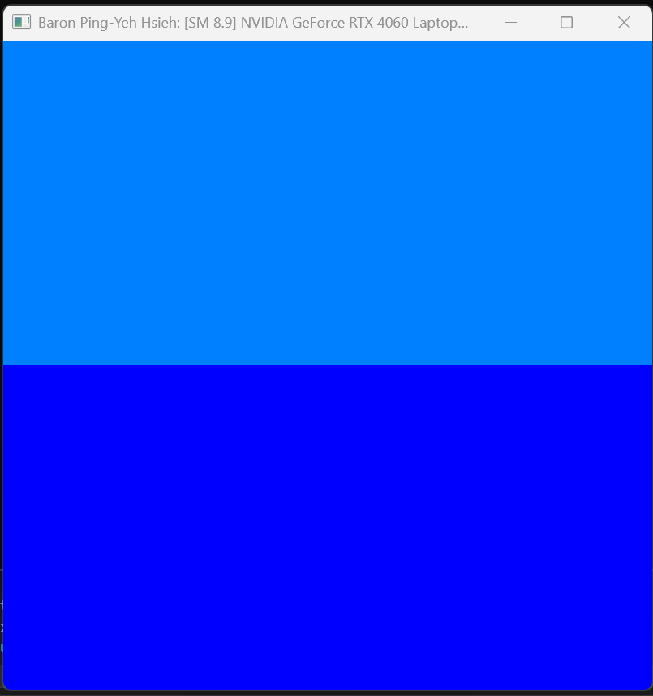
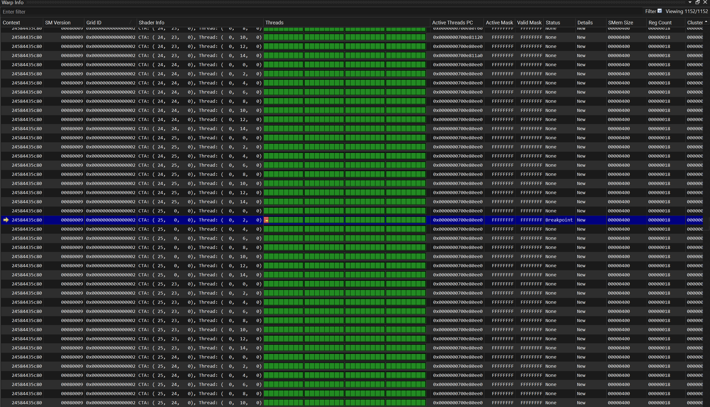
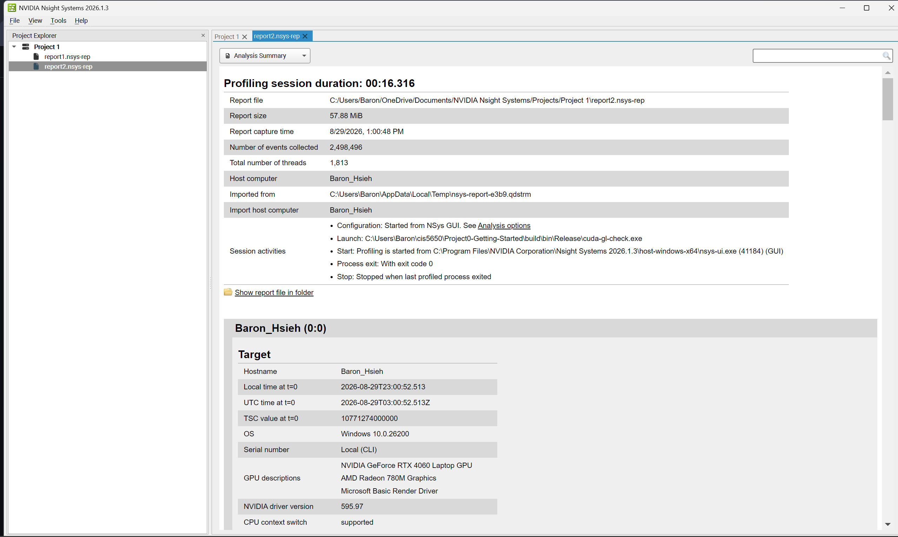
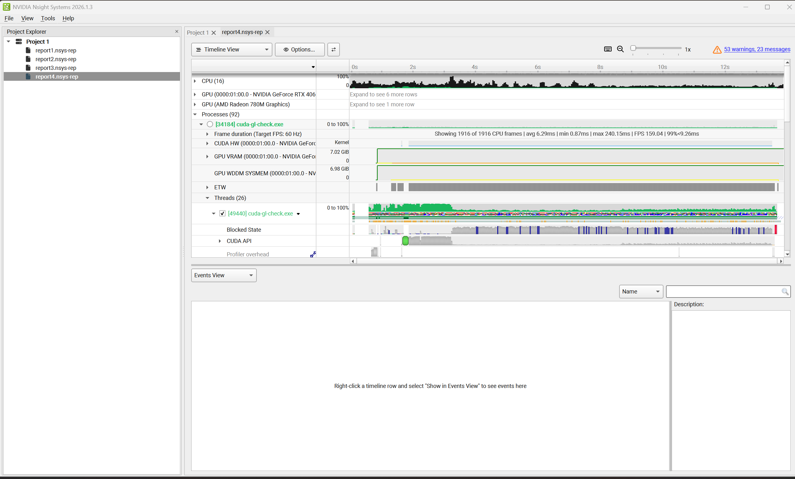
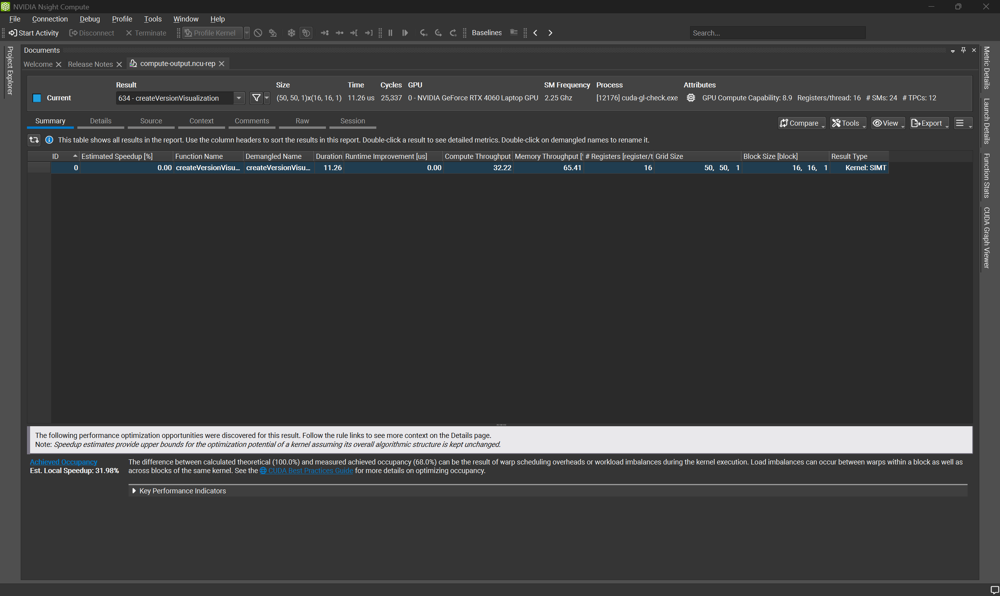
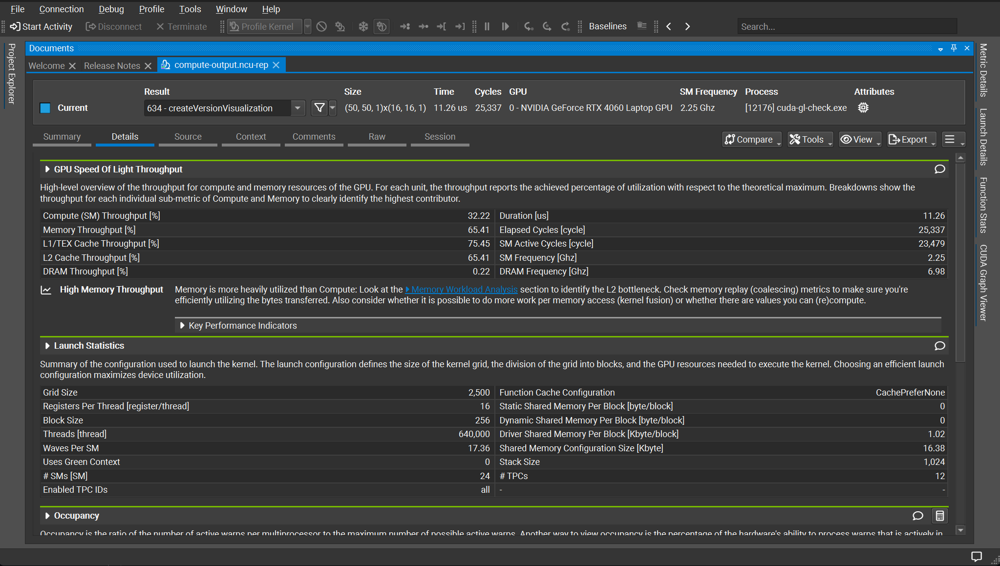
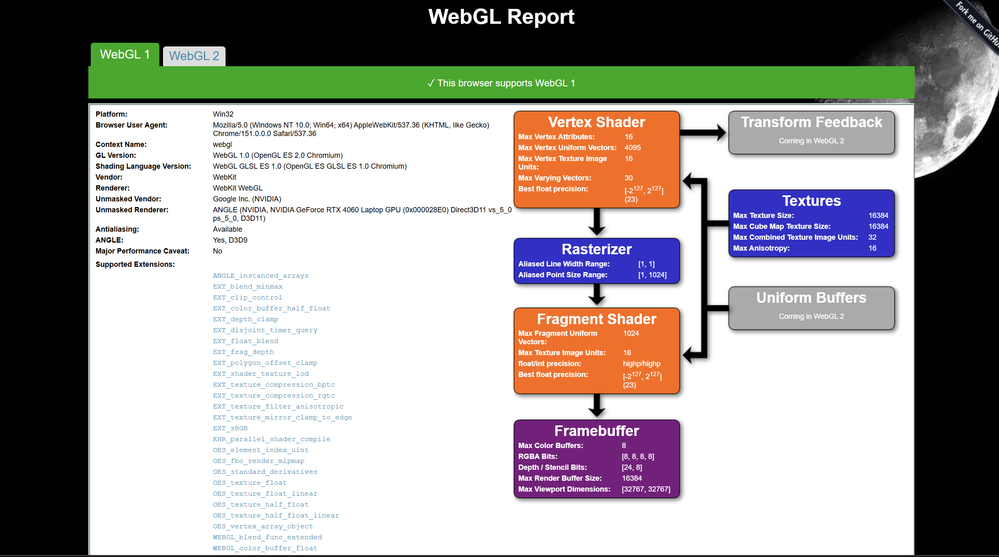
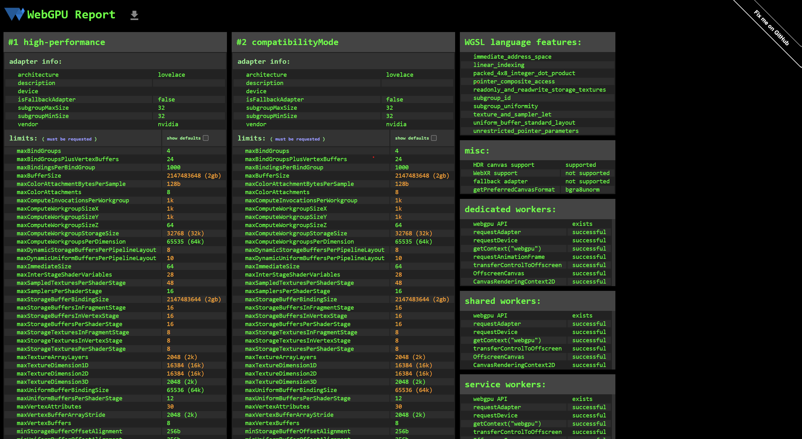

Project 0 Getting Started
====================

**University of Pennsylvania, CIS 5650: GPU Programming and Architecture, Project 0**

* Baron Ping-Yeh Hsieh
  * [LinkedIn](https://www.linkedin.com/in/baron-ping-yeh-hsieh-976376290/)
* Tested on: Windows 11, AMD Ryzen 9 7940HS w/ Radeon 780M Graphics, 16GB RAM, NVIDIA GeForce RTX 4060 Laptop GPU

### README

